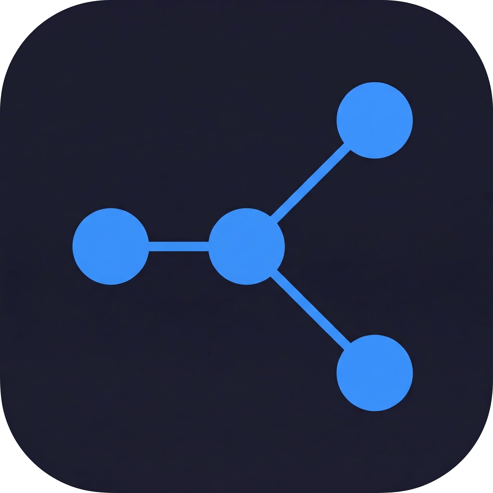
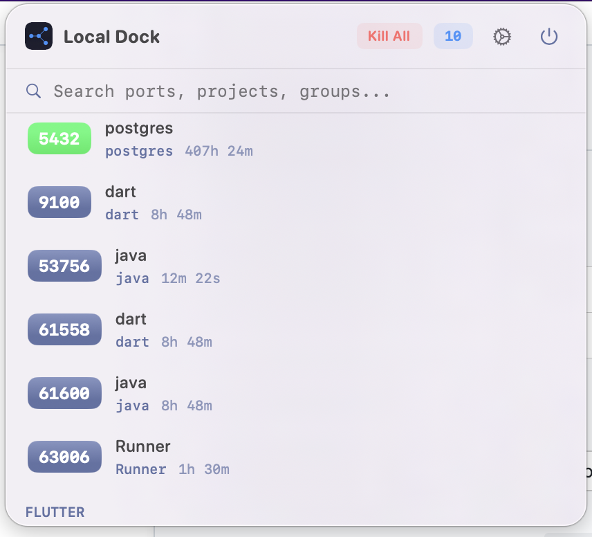

<p align="center">
  
</p>

<h1 align="center">Local Dock</h1>

<p align="center">
  <strong>Monitor and manage your local dev server ports from the macOS menu bar.</strong>
</p>

<p align="center">
  <a href="https://github.com/adfdev/local-dock/releases/latest"></a>
  
  
</p>

---

## Features

- **Real-time port monitoring** — Automatically detects active TCP ports every 3 seconds
- **Smart filtering** — Shows only dev servers (Node, Python, Go, Ruby, Java, Docker, etc.), hides system processes
- **Git integration** — Displays project name and current branch for each port
- **Custom groups** — Organize ports into named groups
- **Custom labels** — Rename any port for quick identification
- **Kill processes** — Terminate individual ports, groups, or all at once with confirmation
- **Quick actions** — Open in browser, copy localhost URL
- **Search** — Filter ports by name, number, project, or group
- **Native macOS** — Built with SwiftUI, lives in your menu bar, no Dock icon
- **Launch at login** — Start automatically with your Mac

## Screenshot

<p align="center">
  
</p>

## Install

### Download

Download the latest `.dmg` from the [Releases](https://github.com/adfdev/local-dock/releases/latest) page.

### Build from source

```bash
git clone https://github.com/adfdev/local-dock.git
cd local-dock
open LocalDock.xcodeproj
```

Build and run with Xcode 15+ (macOS 14+ required).

## Usage

1. Local Dock appears in your menu bar with a port count badge
2. Click the icon to see all active dev server ports
3. Hover over a port to reveal actions: open in browser, copy URL, set label, assign group, kill
4. Use **Settings** (gear icon) to configure groups, notifications, and more

## Tech Stack

- Swift 5 / SwiftUI
- macOS 14+ (Sonoma)
- `lsof` for port scanning
- `git` subprocess for repo/branch detection
- No third-party dependencies

## Troubleshooting

### "LocalDock.app is damaged and can't be opened"

This is a macOS Gatekeeper warning that appears because the app is not signed with an Apple Developer certificate. To fix it, open Terminal and run:

```bash
xattr -cr /Applications/LocalDock.app
```

> If you installed the app in a different folder, replace `/Applications/LocalDock.app` with the correct path.

After running the command, open the app again — it will work normally.

## License

[MIT](LICENSE) — Made by [@adfdev](https://github.com/adfdev)
